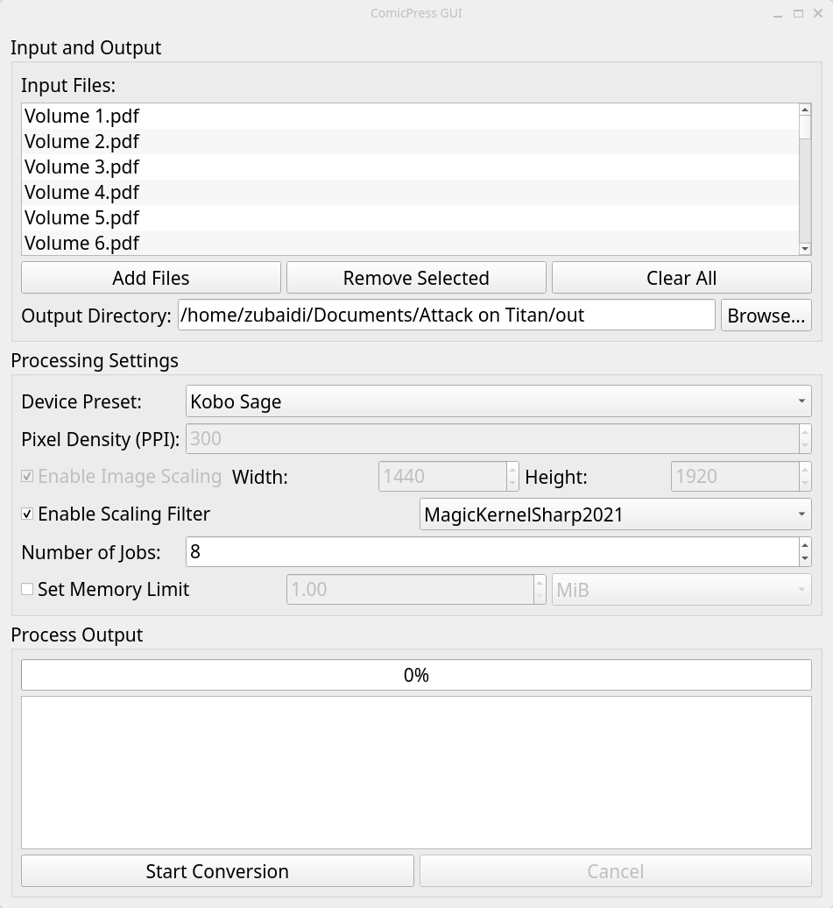

# Important!

This project is now archived. Please see the new [Comicpress](https://github.com/amarz45/comicpress) instead.

# Comicpress

An advanced command-line tool to intelligently convert and optimize digital comics and manga into high-quality, space-saving CBZ archives.



## The Problem

Digital comic book files are often unnecessarily large and not optimized for ereaders. Furthermore, they’re typically optimized for standard LCD screens instead of ereader screens. This can cause comics and manga to look washed out on ereaders. Comicpress is not just a tool to save space, it also makes comics and manga look _significantly_ better. Many existing conversion tools, such as [KCC](https://github.com/ciromattia/kcc), do save space, but often at the cost of quality. KCC does apply gamma correction by default to make most pages look better. However, this effect is indiscriminate, causing some pages to look worse. Comicpress applies smart post-processing, making comics and manga faithfully represent the print version. In short, comicpress gives you the best of all three worlds: _maximum space savings_, _indistinguishable visual fidelity loss_, and _better colouring_.

## Features

- Supported input formats: PDF, CBZ, CBR
- Device profiles: Easily target specific ereader devices to automatically use the correct resolution and pixel density.
- Superior image quality: Uses a multi-stage ImageMagick process, including CLAHE (Contrast Limited Adaptive Histogram Equalization) and gamma correction, to make blacks darker and whites brighter, ensuring pages look crisp and vibrant on an e-ink display.
- Intelligent compression: For PDF files, Comicpress analyzes each page to determine if it’s simple monochrome line art or if it contains color/grayscale. It then applies the best compression strategy for each, drastically reducing file size with visually indistinguishable quality loss.
- Parallel processing: Maximizes speed by converting multiple files in parallel. (This can be configured.)

# Dependencies

### Required

- Bash
- ImageMagick
- poppler-utils
- zip

### Recommended

- GNU Parallel: For a significant performance boost when processing multiple files. The script will work without it, but much more slowly.
- unrar: For CBR file inputs

## Installation

1. Clone the repository:

   ```sh
   git clone https://github.com/amarz45/comicpress
   cd comicpress
   ```

2. Install:

   ```sh
   sudo make install
   ```

## Uninstallation

```sh
sudo make uninstall
```

## Usage

I recommend using the GUI. However, here are some command-line examples:

1. Using a device profile: The easiest way to run the script. It automatically configures the resolution and density for your device.

   ```sh
   comicpress -device "Kobo Sage" -d output_dir input_manga/*
   ```

2. Using manual settings: Provides full control over the output resolution and density.

   ```sh
   comicpress -density 300 -width 1440 -height 1920 -d output_dir input_manga/*
   ```

3. Changing the scaling filter: Overrides the default filter for a different look.[^1]

   ```sh
   comicpress -device "Kobo Sage" -filter Lanczos -d output_dir input_manga/*
   ```

You can view a full list of options by running `comicpress -help`.

[^1]: It’s strongly recommended to leave this to the default setting for the best quality.
